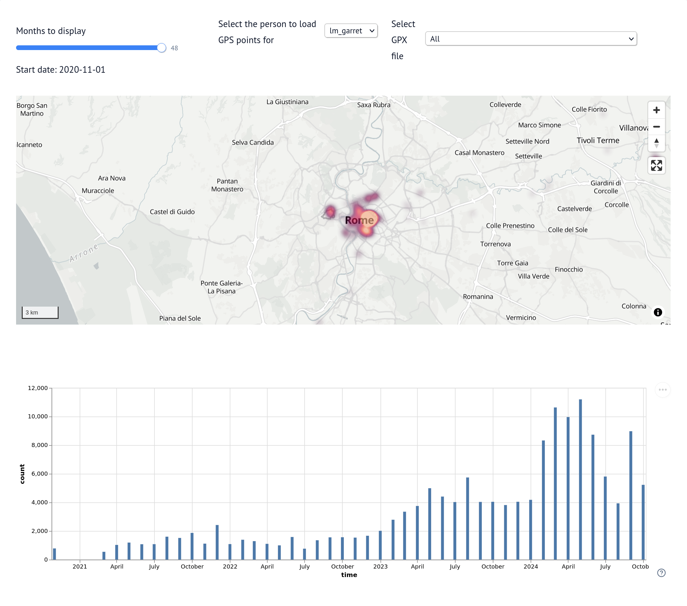

# Nextcloud + HomeAssistant based GPS Heatmap
This repository is an exercise to test `marimo` out as a Jupyter replacement, combined with a small data visualization on GPS coordinates recorded on the past ~4 years.

In this marimo notebook, we load GPS data points from multiple data sources, and derive a heatmap out of it. The time window for the heatmap can be configured with a slider, and some data tables can be tweaked using marimo UI select boxes.

We use data coming from:
 - InfluxDB, as stored by HomeAssistant when tracking a user's location via the companion app (Android)
 - GPX files, originally coming from the Android FOSS app PhoneTrack and pushed to Nextcloud maps

Both data sources require some data cleaning and alignement, which the notebook handles and explains.

Finally, we build a single DataFrame using all these sources, and derive a weight for each data point to ensure that the heatmap is built on the intensity and not the sampling frequency.

## Screenshots

<figure class="image">
    
    <figcaption>Running the notebook as an app, focusing on some Roman holidays :)</figcaption>
</figure>

## Running the notebook
The notebook requires [`marimo`](https://docs.marimo.io/getting_started/index.html) to run, and [`uv`](https://docs.astral.sh/uv/getting-started/installation/) is recommended. I'd recommend installing the latter first and then installing `marimo` with:
```command
uv tool install marimo --upgrade
```

The notebook contains the instructions to setup your InfluxDB credentialss and load GPX files. Run the notebook with:

```command
marimo edit --sandbox gps-heatmap.py
```

You may also run it as a single app with 
```command
marimo run --sandbox gps-heatmap.py
```
but you won't have any markdown explanations displayed.
